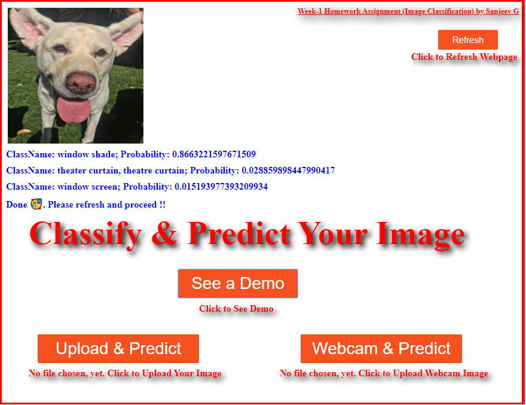

# Week-1-Project 
1- Week-1 Project, Image Classification; 
2- There are two files in this project - index.html and index.js; 
3- Open index.html in Google Chrome to display the homepage; 
4- Click on "See a Demo" button to see the image classification and prediction using Tensorflow.js; 
5- The image classification and prediction results are shown on the homepage; 
6- "Upload & Predict" button is to upload a local disk image for MobileNet to classify but it does not work yet because of an error from MobileNet model which seems to be expecting an image with web url address or an image on the web. 
7- "Webcam & Predict" button with KNN classifier is a place holder and not implemented yet in this version; 

Week1 Project Screen Shot: 
  
